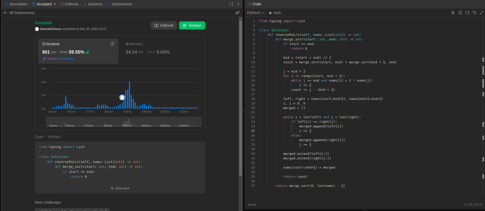
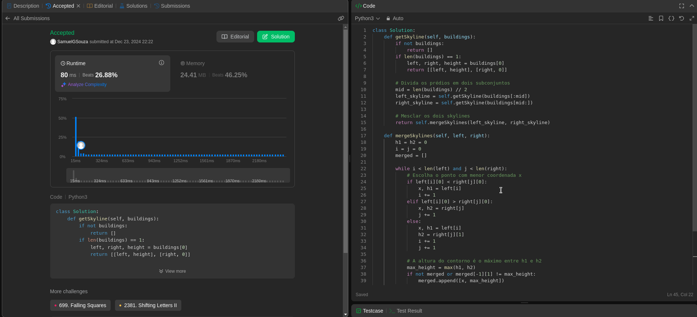
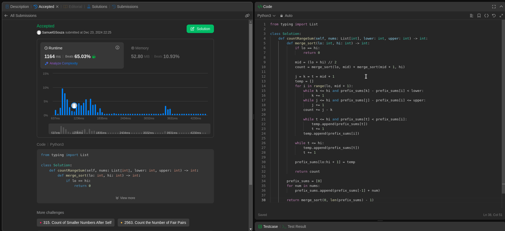

# Questões - Juíz Online

**Número da Lista**: 24 
**Conteúdo da Disciplina**: D&C 

## Alunos

| Matrícula  | Aluno                               |
| ---------- | ----------------------------------- |
| 21/1030649 | Yan Werlley de Freitas Paulo |
| 21/1030881 | Samuel Gomes de Souza         |

## Apresentação

A apresentação pode ser vista [aqui](https://youtu.be/eV7wLrcxzzQ).

## Sobre

Este projeto consiste na realização de exercícios da plataforma de juiz online LeetCode. São desenvolvidos problemas Difícil e Média
complexidade sobre Dividir e Conquistar.

## Screenshots

#### Exercício 01 - 

Dificuldade: Difícil  
Descrição do Problema: [Reverse Pairs](https://leetcode.com/problems/reverse-pairs/description/) 
Solução: 

#### Exercício 02 - 

Dificuldade: Difícil  
Descrição do Problema: [The Skyline Problem](https://leetcode.com/problems/the-skyline-problem/description/?envType=problem-list-v2&envId=divide-and-conquer) 
Solução: 

#### Exercício 03 - 

Dificuldade: Difícil  
Descrição do Problema: [Count of Range Sum](https://leetcode.com/problems/count-of-range-sum/description/) 
Solução: 

## Instalação

**Linguagem**: Python  

## Uso

Para executar os códigos, é recomendado clicar no link do problema que direciona para o LeetCode e rodar o código diretamente na plataforma.
<!--## Outros

Quaisquer outras informações sobre seu projeto podem ser descritas abaixo.

-->